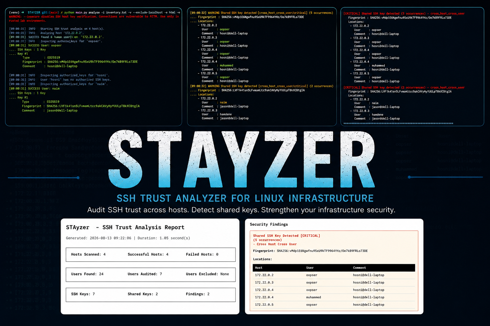
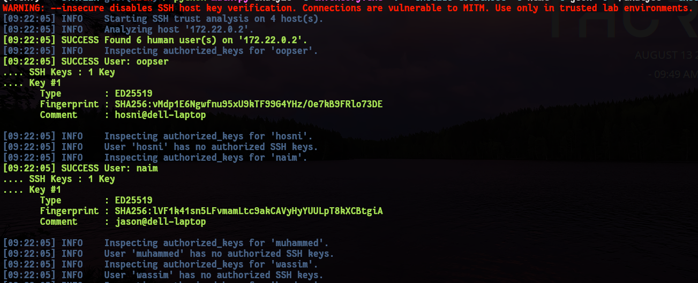
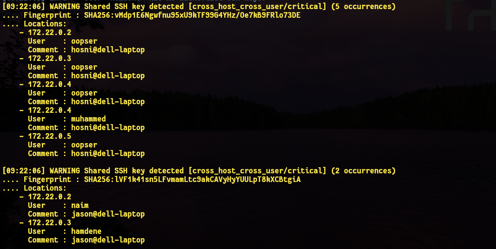
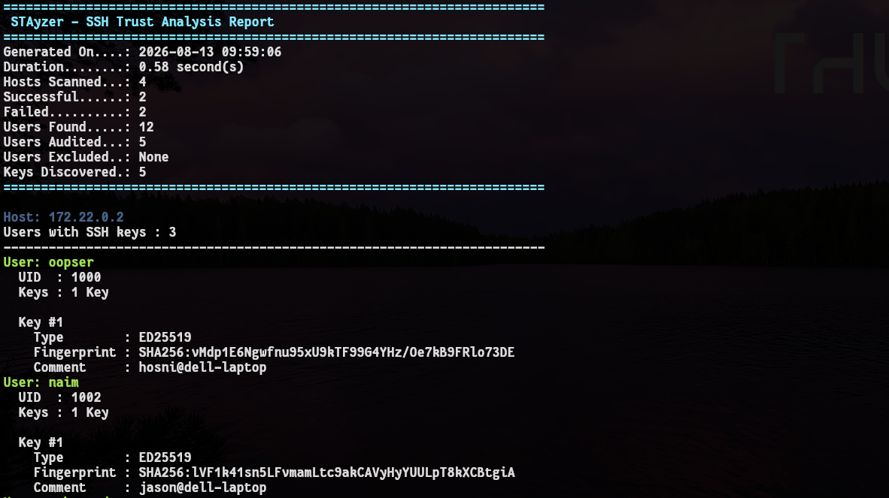
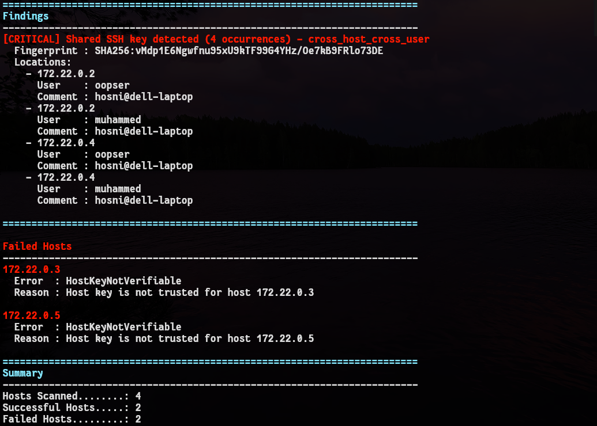
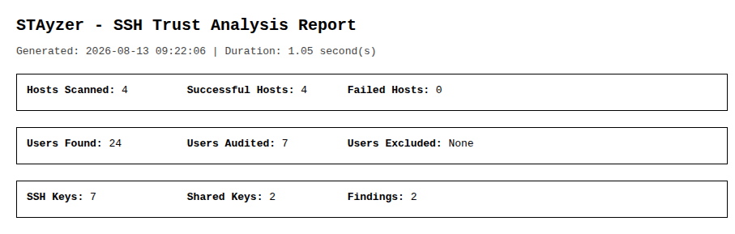
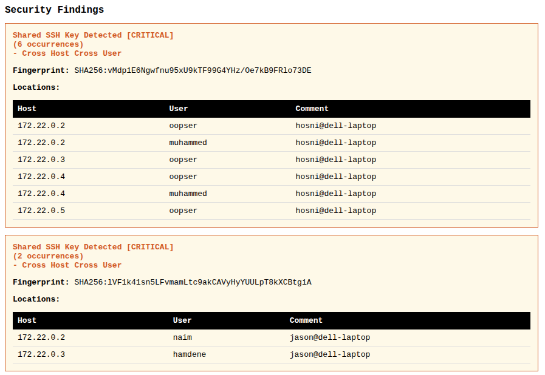
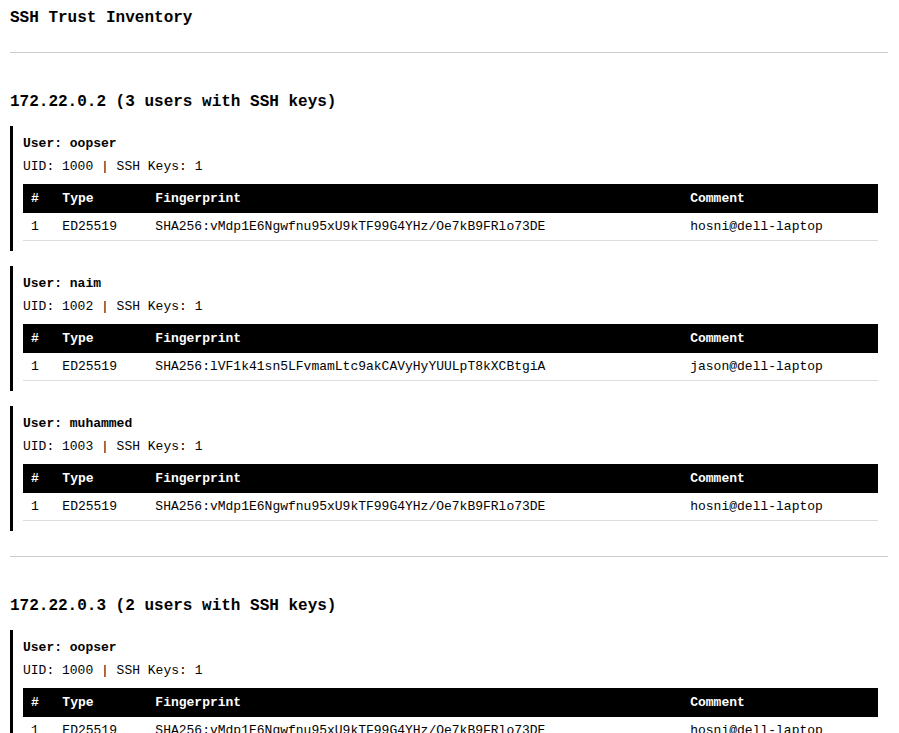
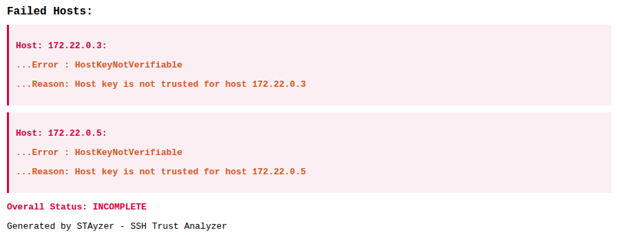

<p align="center">
  
</p>

# STAyzer

> **SSH Trust Analyzer for Linux Infrastructure**


STAyzer is a Python-based command-line tool that audits SSH trust relationships across Linux systems by analyzing users' `authorized_keys` files. It discovers who can access each machine, detects shared SSH keys, identifies potentially risky trust relationships, and generates detailed reports in both human-readable and machine-readable formats.

Designed for Linux administrators, DevOps engineers, and security professionals, STAyzer makes it easy to audit SSH trust across dozens or hundreds of servers.

---

## Features

- Audit local and remote Linux hosts
- Analyze every user's `authorized_keys`
- Automatically discover human users
- Support multiple hosts using an inventory file
- Detect custom `AuthorizedKeysFile` locations from `sshd_config`
- Compute SHA256 fingerprints for every authorized SSH key
- Detect shared SSH keys across hosts and users
- Classify duplicate keys by severity
- Filter analysis by user or host
- Export reports as HTML and JSON
- Generate clear console reports
- Asynchronous SSH connections for improved performance
- Secure by default with SSH host key verification

---

> ## Screenshots
>
> Screenshots of STAyzer's output and reports are available in the **Screenshots** section below.

# Why STAyzer?

As infrastructures grow, it becomes increasingly difficult to answer questions like:

- Which users have SSH access?
- Is the same SSH key installed on multiple servers?
- Are different users sharing the same private key?
- Which service accounts reuse the same SSH credentials?
- Which hosts could not be audited?

Manually checking every `authorized_keys` file quickly becomes impractical.

STAyzer automates this process and provides a complete overview of your SSH trust relationships.

---

# Installation

Clone the repository:

```bash
git clone https://github.com/hosnizaaraoui/STAYZER.git
cd STAYZER
```

Create a virtual environment:

```bash
python3 -m venv .venv
source .venv/bin/activate
```

Install dependencies:

```bash
pip install -r requirements.txt
```

---

# Basic Usage

Analyze the local machine:

```bash
python main.py analyze
```

Analyze a single remote host:

```bash
python main.py analyze \
    --host 192.168.1.20
```

Analyze multiple hosts:

```bash
python main.py analyze \
    --host server01 \
    --host server02 \
    --host server03
```

Analyze hosts from an inventory:

```bash
python main.py analyze \
    --inventory inventory.txt
```

---

# Inventory File

An inventory contains one host per line.

Example:

```text
192.168.1.10
192.168.1.20
192.168.1.30
```

You may also specify a different SSH user for individual hosts.

```text
server01
server02>ubuntu
server03>root
```

The username after `>` overrides the default SSH user only for that host.

---

# Command Reference

## Specify Remote Hosts

```bash
--host
```

Can be provided multiple times.

Example:

```bash
python main.py analyze \
    --host web01 \
    --host db01
```

---

## Inventory

```bash
--inventory
```

Reads hosts from a text file.

Example:

```bash
python main.py analyze \
    --inventory inventory.txt
```

---

## SSH Username

```bash
--user
```

Default:

```text
oopser
```

Example:

```bash
python main.py analyze \
    --host server01 \
    --user admin
```

---

## Exclude Localhost

Skip analysis of the local machine.

```bash
--exclude-localhost
```

Example:

```bash
python main.py analyze \
    --inventory inventory.txt \
    --exclude-localhost
```

---

## Known Hosts File

Specify a custom SSH known_hosts file.

```bash
--known-hosts
```

Example:

```bash
python main.py analyze \
    --host server01 \
    --known-hosts ~/.ssh/known_hosts
```

---

## Insecure Mode

```bash
--insecure
```

Disables SSH host key verification.

⚠️ Intended **only** for trusted lab environments.

Example:

```bash
python main.py analyze \
    --host lab-machine \
    --insecure
```

---

## Filtering

Analyze only specific users or hosts.

Examples:

Filter a username:

```bash
python main.py analyze \
    --inventory inventory.txt \
    --filter "username=alice"
```

Filter a host:

```bash
python main.py analyze \
    --inventory inventory.txt \
    --filter "host=web01"
```

---

## Verbose Mode

Show detailed execution progress.

```bash
-v
```

Example:

```bash
python main.py analyze \
    --inventory inventory.txt \
    -v
```

---

## Export Reports

Supported formats:

- HTML
- JSON

Example:

```bash
python main.py analyze \
    --inventory inventory.txt \
    --export html
```

Export multiple formats:

```bash
python main.py analyze \
    --inventory inventory.txt \
    --export html \
    --export json
```

---

## Output Name

Specify the output filename (without extension).

```bash
--output report
```

Produces:

```
report.html
report.json
```

---

# Example

```bash
python main.py analyze \
    --inventory inventory.txt \
    --user admin \
    --filter "username=deploy" \
    --export html \
    --export json \
    --output ssh_audit \
    -v
```

---

# Duplicate Key Detection

One of STAyzer's primary capabilities is identifying SSH public keys that appear on multiple accounts or hosts.

Each duplicate is classified according to its potential security impact.

| Severity | Category                 | Description                                                                                                                                                    |
| -------- | ------------------------ | -------------------------------------------------------------------------------------------------------------------------------------------------------------- |
| Low      | Shared Service Account   | The same username reuses the same SSH key across multiple hosts. This is common for automation or deployment accounts.                                         |
| Medium   | Same Host Multiple Users | Multiple local users on the same host share the same SSH key. This is often the result of manual key copying or poor account management.                       |
| Critical | Cross Host Cross User    | Different users on different hosts share the same SSH key. This usually indicates key reuse between unrelated accounts and should be investigated immediately. |

---

# Reports

STAyzer generates a complete audit containing:

- Scan information
- Hosts analyzed
- Users discovered
- SSH keys found
- SHA256 fingerprints
- Duplicate key findings
- Failed hosts
- Scan statistics
- Overall result

Supported formats:

- Console
- HTML
- JSON

---

# Security

By default STAyzer verifies SSH host keys before establishing a connection.

Using:

```bash
--insecure
```

disables this verification and makes connections vulnerable to Man-in-the-Middle (MITM) attacks.

Only use this option in disposable or trusted laboratory environments.

---

# Typical Use Cases

- SSH trust auditing
- Infrastructure security reviews
- Linux server hardening
- Internal security assessments
- Detecting shared SSH credentials
- Compliance verification
- Periodic SSH access reviews

---

# Roadmap

Future releases may include:

- Risk scoring
- Interactive HTML reports
- Key age analysis
- Authorized principals support
- Historical comparison between scans
- Configuration file support
- Additional security findings

---

# Screenshots

## Verbose Analysis

Live execution showing host discovery, user enumeration, and SSH key collection.

<p align="center">
  
</p>

---

## Shared Key Detection

Example of a finding where the same SSH key is shared across multiple hosts or users.

<p align="center">
  
</p>

---

## Console Report

Overview of the generated console report.

<p align="center">
  

  

</p>

---

## HTML Report Overview

Overview section of the generated HTML report including scan statistics.

<p align="center">
  
</p>

---

## HTML Findings

Security findings section showing detected duplicate keys with their severity levels.

<p align="center">
  
</p>

---

## Host Details

Detailed view of a scanned host including discovered users and authorized SSH keys.

<p align="center">
  
</p>

---

## Failed Hosts

Example of a failed connection caused by authentication or host verification issues.

<p align="center">
  
</p>

---

# Project Status

> **Note**
>
> STAyzer is currently part of the **OOPS (Operations Optimization & Python Scripts)** collection.
>
> The version included in OOPS represents the initial public release. As the project grows with additional features, tests, and documentation, development will continue in its own dedicated repository while OOPS will continue to host the original release.

---

# License

This project is licensed under the MIT License.

---

# Author

**Hosni Zaaraoui**

Linux • System Administration • Infrastructure Automation • Cybersecurity
